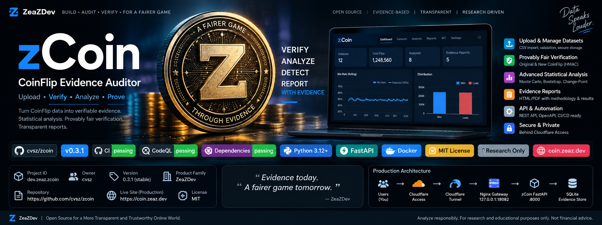

<p align="center">
  
</p>

<div align="center">

# zCoin

### CoinFlip Evidence Auditor

**Verify randomness. Measure evidence. Reject guesswork.**

[](https://github.com/cvsz/zcoin/releases)
[](VERSION)
[](https://github.com/cvsz/zcoin/actions/workflows/ci.yml)
[](https://github.com/cvsz/zcoin/actions/workflows/codeql.yml)
[](https://github.com/cvsz/zcoin/actions/workflows/dependency-review.yml)
[](https://www.python.org/)
[](https://fastapi.tiangolo.com/)
[](Dockerfile)
[](LICENSE)
[](SECURITY.md)
[](https://zcoin.zeaz.dev)

**Repository:** `cvsz/zcoin` · **Project ID:** `dev.zeaz.zcoin` · **Release:** `v0.3.1`

[Brand assets](docs/BRANDING.md) · [Project identity](docs/project-identity.md) · [Production runbook](docs/production.md)

</div>

---

## Project identity

| Field | Identity |
|---|---|
| Product | **zCoin** |
| Full name | **zCoin — CoinFlip Evidence Auditor** |
| Project ID | `dev.zeaz.zcoin` |
| Product family | `ZeaZDev` |
| Repository owner | `cvsz` |
| Canonical repository | `https://github.com/cvsz/zcoin` |
| Canonical application URL | `https://zcoin.zeaz.dev` |
| Current version | `0.3.1` |
| Release channel | `stable` |
| Runtime | Python 3.12 + FastAPI |
| Persistence | SQLite, local persistent volume |
| Production gateway | Nginx on `127.0.0.1:18082` |
| Edge security | Cloudflare Access + Tunnel, owned by `cvsz/zworkforce` |
| License | MIT |
| Operating mode | Historical verification, evidence analysis, paper simulation |

The machine-readable identity contract lives in [`PROJECT_IDENTITY.json`](PROJECT_IDENTITY.json), with the complete identity and release policy documented in [`docs/project-identity.md`](docs/project-identity.md).

> **Scope boundary:** zCoin verifies revealed-seed history and measures statistical evidence. It does not place live bets, obtain hidden server seeds, bypass authentication, automate accounts, or claim guaranteed wins.

## What zCoin does

`zCoin` is an offline-first audit stack for verifying revealed-seed CoinFlip history and testing whether an apparent statistical edge survives cryptographic integrity checks, multiple-testing correction, holdout validation, seed-epoch replication, Bayesian/Bootstrap analysis, and Monte Carlo null baselines.

### Evidence pipeline

```text
Historical exported data
        ↓
Schema + duplicate validation
        ↓
Server-seed commitment verification
        ↓
HMAC-SHA256 outcome reproduction
        ↓
Nonce / sequence integrity audit
        ↓
Distribution + independence analysis
        ↓
Bootstrap + Bayesian inference
        ↓
BH-FDR multiple-testing correction
        ↓
Chronological holdout validation
        ↓
Cross-seed-epoch replication
        ↓
Economic break-even gate
        ↓
Evidence classification + report
```

## Features

- old/new HMAC-SHA256 CoinFlip verifier mappings
- SHA-256 revealed server-seed commitment checks
- idempotent CSV ingestion with SQLite persistence
- nonce duplicate/gap/order auditing
- proportion, runs, streak, autocorrelation and transition analysis
- bootstrap 99% confidence intervals
- Bayesian posterior probability above economic break-even
- change-point signals and chronological train/holdout validation
- seed-epoch segmentation and Benjamini-Hochberg FDR correction
- conservative evidence scoring and classification
- paper-only strategy comparison, walk-forward simulation and Monte Carlo null models
- deterministic dataset SHA-256 evidence fingerprints
- JSON evidence bundles and printable HTML reports
- FastAPI dashboard/API
- non-root Docker runtime
- loopback-only production Nginx gateway on `18082`
- CI, CodeQL, dependency review, release ZIP + SHA-256

## Release quality gates

A release is considered publishable only when the repository passes the automated test suite, Python compilation, Docker build, Compose validation, repository secret/scope guards, Dependency Review, and CodeQL. Tag pushes matching `v*` run the release workflow, rebuild/test the project, package a source ZIP, generate a SHA-256 checksum, and publish a GitHub Release.

Current application release: **v0.3.1**. Public production cutover additionally depends on the Cloudflare DNS/Access/Tunnel configuration owned by `cvsz/zworkforce`.

## Quick start

```bash
python3 -m venv .venv
source .venv/bin/activate
pip install -r requirements.txt
PYTHONPATH=. pytest -q
uvicorn app.main:app --host 127.0.0.1 --port 8000
```

Docker development:

```bash
docker compose up --build -d
curl http://127.0.0.1:8000/healthz
```

Production origin:

```bash
./deploy/deploy.sh
./deploy/verify.sh
```

## Cloudflare ownership boundary

`zcoin` owns the application and loopback gateway. `cvsz/zworkforce` owns DNS, Cloudflare Access and the shared tunnel. Intended mapping:

```text
zcoin.zeaz.dev
    ↓
Cloudflare Access
    ↓
Cloudflare Tunnel
    ↓
127.0.0.1:18082
    ↓
Nginx gateway
    ↓
auditor:8000
```

Do not reuse `18080`; it belongs to zDash. See [`docs/cloudflare.md`](docs/cloudflare.md) before changing tunnel state.

## CSV input

Minimum:

```csv
client_seed,nonce,reported_result
client-a,1001,0
client-a,1002,1
```

Full audit history after server-seed reveal:

```csv
ts,bet_id,server_seed,server_seed_hash,client_seed,nonce,round,reported_result,amount,payout_multiplier
2026-09-10T10:00:00Z,b1,REVEALED_SEED,SHA256_COMMITMENT,CLIENT,1001,1,0,1,1.98
```

Never put passwords, cookies, access tokens, account credentials, or unrevealed secrets in datasets.

## API

```text
GET    /healthz
GET    /api/version
POST   /api/verify
POST   /api/ingest
GET    /api/datasets
GET    /api/analysis/{dataset}
GET    /api/advanced/{dataset}
GET    /api/evidence/{dataset}
DELETE /api/datasets/{dataset}
GET    /api/paper/compare/{dataset}
GET    /api/paper/walk-forward/{dataset}
GET    /api/paper/monte-carlo/{dataset}
GET    /report/{dataset}
```

The strongest evidence classification requires complete cryptographic result coverage and independent replication. A historical anomaly is not a prediction of the next flip.
